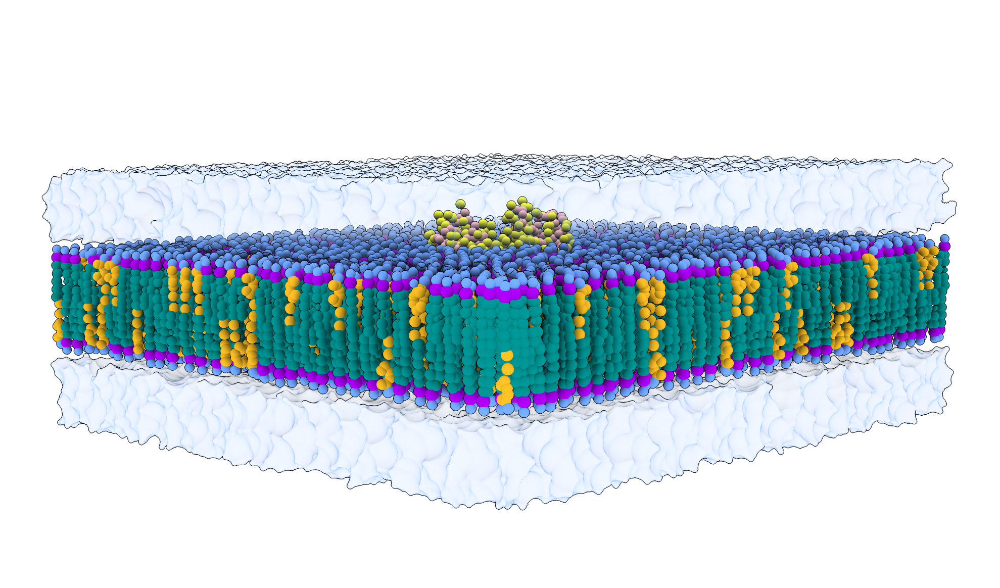

# Coarse-grained System Builder (CGSB)

CGSB is a Python-based software for building flat membranes in coarse-grained resolution. It handles asymmetric membranes, phase-separated systems, multiple bilayers, protein insertion, solvation and flooding with one or multiple solute molecules of choice.

CGSB is versatile, fast, easy-to-use, but it also allows for high-level of customisation. It can be used either as a **Python package** or directly from the **terminal command line**. It neatly handles multiple parameter libraries (even within the same system), making it developer-friendly. 

CGSB is continuously under development and we welcome suggestions for new features. 

## Citation

Andreasen _et al._ (2024) TBD.

## Installation 

**Version 1**

    conda env create -f environment.yml 

    conda activate CGSB

    python -m ipykernel install --user --name=CGSB

**Version 2**

    conda create --name CGSB python==3.9

    conda activate CGSB

    pip install numpy==1.21.5 scipy==1.7.3 alphashape matplotlib ipykernel ipywidgets

    python -m ipykernel install --user --name=CGSB

## Basic usage 

For a detailed introduction to the software, please consult [CGSB Documentation](CGSB_Documentation.pdf).

For a quick reminder of available commands, you can use the [Cheat Sheet](CGSB_Cheat_Sheet.pdf).

Two [tutorials](Tutorial) are available as Jupyter Notebooks, one covering the basics and another covering more advanced functionalities.

It includes (amongst other systems):

* **Simple membrane with protein**: A simple POPC membrane with a protein in solvent (water + 0.15 M NaCl) which explains the various arguments in CGSB
* **Asymmetric membrane**: An asymmetric complex membrane (POPC, POPE and CHOL) in solvent with different area per lipid values for each membrane
* **Phase separated Membrane**: A phase separated membrane
* **Monolayers**: Two monolayers with solvent between them and vacuum over the pbc
* **Nanodisc**: A nanodisc with DMPC lipid contained within and with solvent surrounding it
* **Holes**: A membrane with multiple manually defined holes
* **Patches**: Multiple manually shaped membrane patches
* **Matryoshka membrane**: A matryoshka membrane with a protein in the center
* **Stacked membranes**: Three vertically stacked membranes
* **Mixed solvent**: A symmetric membrane solvated with regular and small water beads in specified ratios
* **Phase separated solvent**: A symmetric membrane solvated with two solvent volumes containing different salt concentrations
* **Flooding of imported solutes**: A membrane system that has been flooded with imported solute molecules, followed by solvation
* **CGSB logo**: Our logo

## Licence

CGSB is preserved under the [Apache License 2.0](https://github.com/MikkelDA/CGSB/blob/main/LICENSE).

