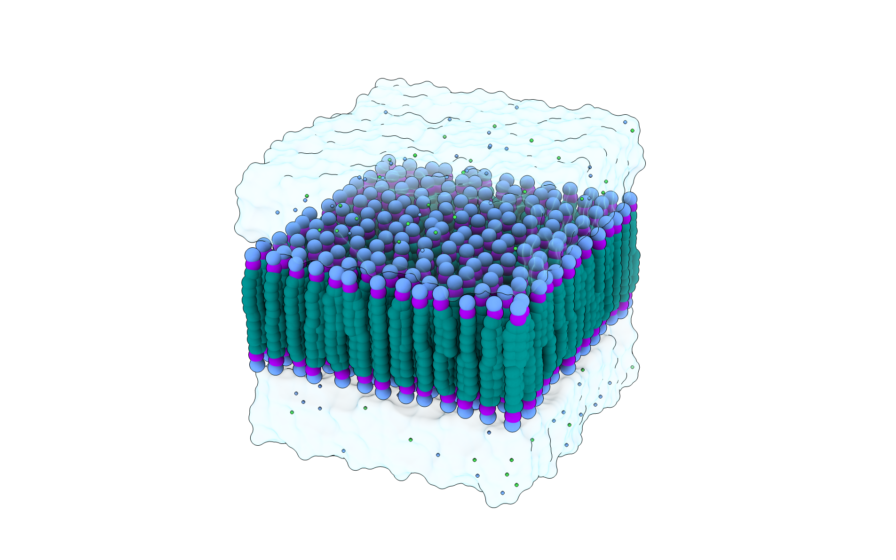
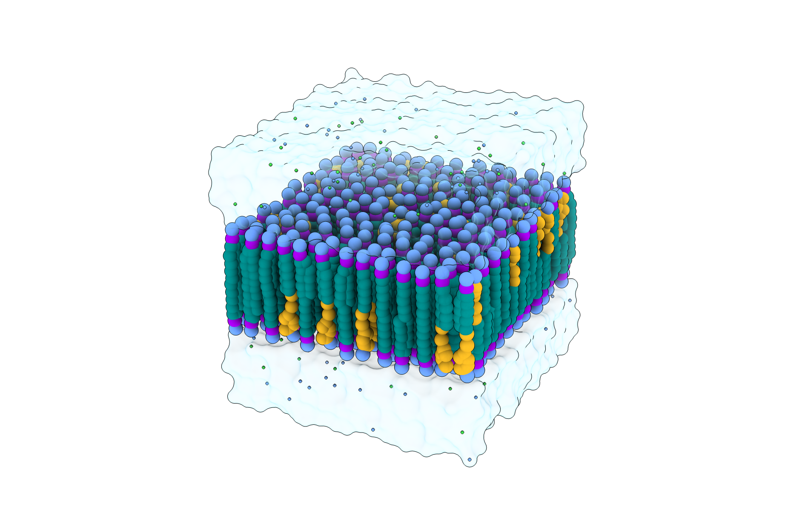
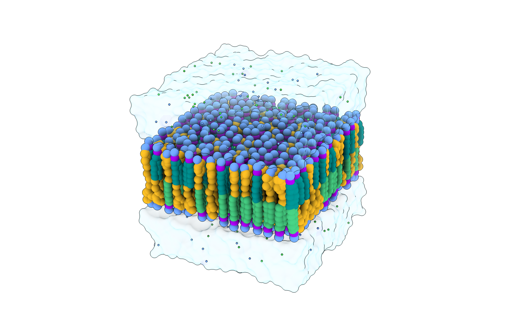
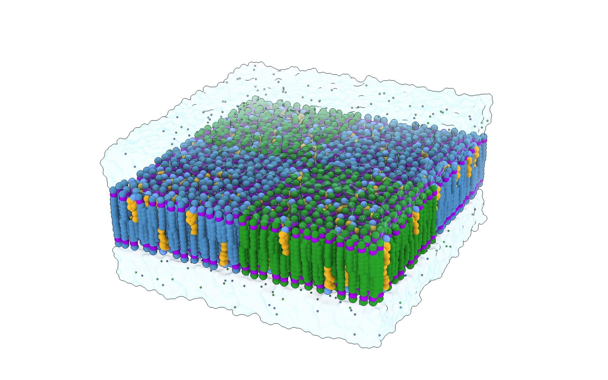
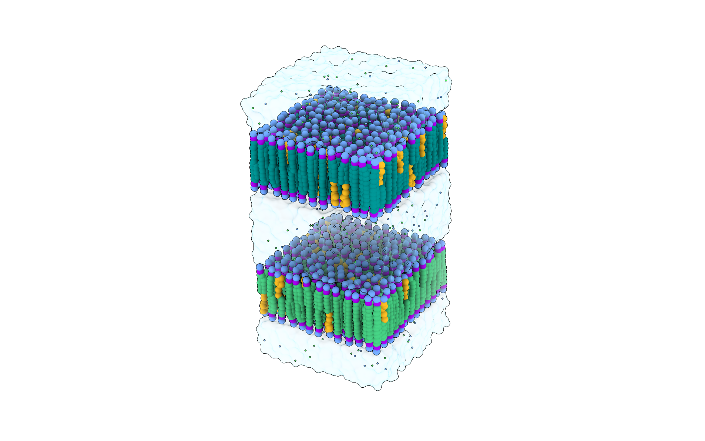
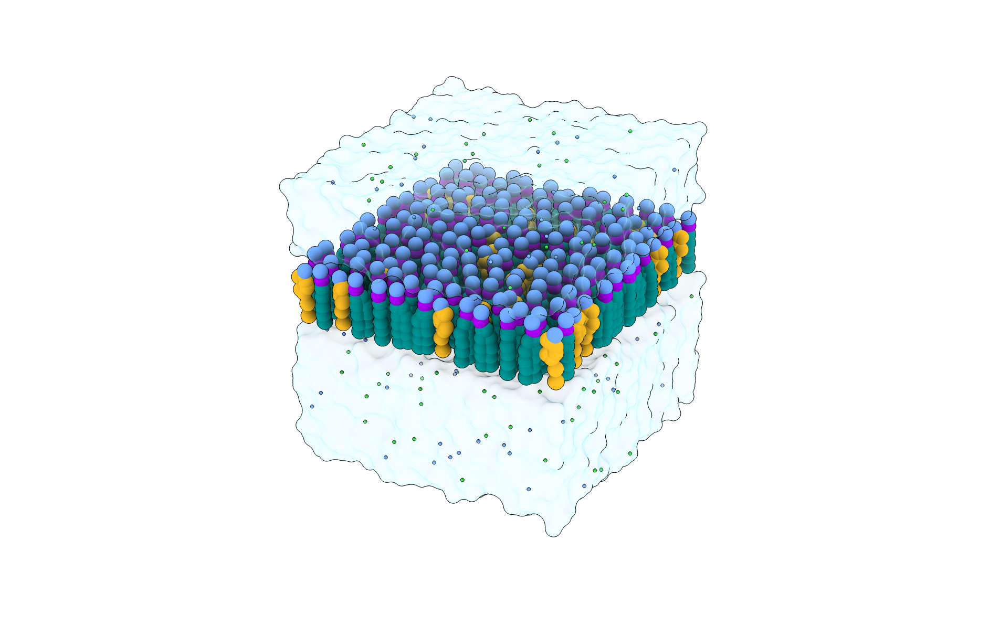
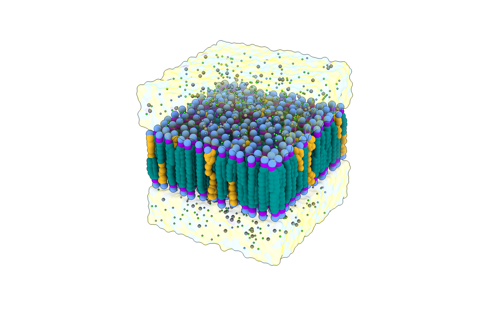

# CGSB Tutorial

For a detailed introduction to the software, please consult [CGSB Documentation](../CGSB_Documentation.pdf).

For a quick reminder of available commands, you can use the [Cheat Sheet](../CGSB_Cheat_Sheet.pdf).

This tutorial is available as a Jupyter Notebook and it systematically presents build procedures, from very simple to very complex systems.

It includes:

* **basic system**: simple POPC membrane in solvent (water + 0.15 M NaCl)

* **simple system**: symmetric complex membrane (POPC and CHOL) in solvent

* **membrane with protein system**: symmetric complex membrane with specified membrane APL and a transmembrane protein

* **asymmetric membrane system**: asymmetric complex membrane with bespoke APL values in each leaflet

* **protein in solvent**: protein in water and 0.15 M NaCl, without a membrane

* **phase-separated system**: membrane with defined patches of different compositions

* **phase-separated system generator**: a code for making of customisable grid of membrane patches

* **multiple bilayers system**: two membranes offset in the z direction

* **monolayer system**: upper-facing complex monolayer

* **mixed solvent system**: symmetric complex membrane solvated with regular and small water beads in specified ratios

* **flooding system**: flooding the membrane-containing system with solute molecules, followed by solvation

* **abstract art**: just for fun

